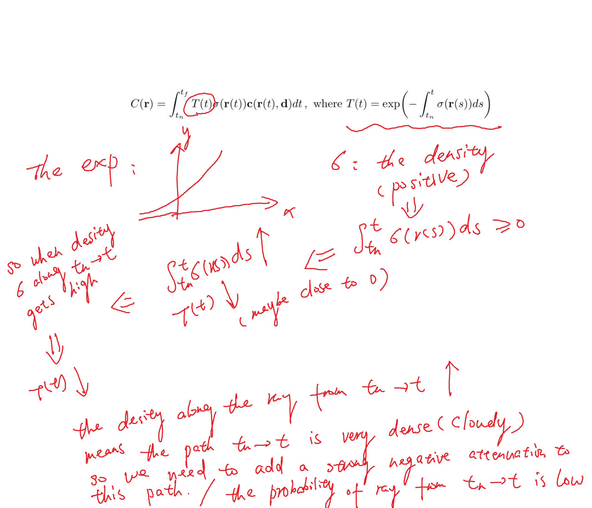
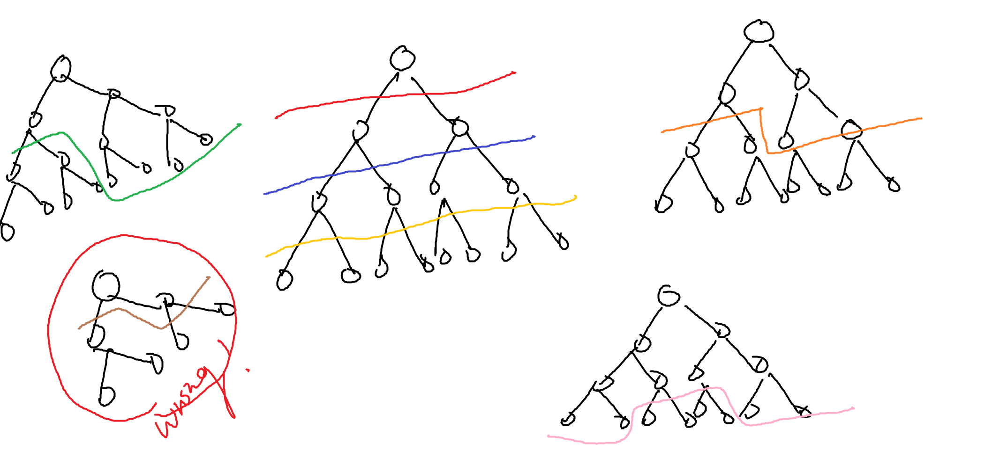

### Presentation info
* Paper title: *N-BVH: Neural ray queries with bounding volume hierarchies*
* Date & time: 2024.07.02, 9:00 p.m. - 10:30 p.m.
* Slide pages: 45
* Outline: Backgrounds, Methods (of the paper) and Results from the paper
* Presentation style: Top-down

### Backgrounds 
Backgrounds are divided into two parts: conventional rendering methods and well-known neural rendering.
* Conventional rendering techs
  * Ray tracing (Simplest case and advanced one), Rendering eq.
  * Prefiltering (I just pick one I familiar with: Mipmap)
  * BVH
* Neural rendering techs
  * NeRF
  * Neural Radiosity
  * Instant-NGP

#### Methods
First talk about the overall fundamental pipeline of their method (page 31), then their refinement on this pipeline (N-BVH).

### Discussions
During the group meeting there are some discussions.
* The discussion on the rendering equation;
   * The expression for the rendering eq. (upper eq.) in my slides is not the standard rendering eq (lower eq.) in the textbook; In the standard rendering eq., the integral is not defined recursively.
$$
L_o(\bold x, \omega_o) = \int_\Omega f_r(\bold x, \omega_i, \omega_o)L_o(\bold x', \omega_i)(\omega_i\cdot \bold n )\text{d} \omega_i\\
L_r(\bold x, \omega_o) = \int_\Omega f_r(\bold x, \omega_i, \omega_o)L_i(\bold x, \omega_i)(\omega_i\cdot \bold n )\text{d} \omega_i
$$
* The discussion on NeRF;
   * On the volume rendering expression of NeRF, there is argument on how to call the $T(t)$ function. From Prof. Hanqi, it's the attenuation that needs to be multiplied with $C (=density \times color)$ when ray $r$ gets to a space point $r(t)$, and since I read this from some material, they call it `the possibility of ray r getting from t_n to t` and this makes sense. Let's see:

* The discussion on Neural Radiosity (longest discussion on this, and Yuxiao found it interesting)
   * Treat the rendering eq. as LHS and RHS, let a MLP to represent $L(x, \omega_o)$ and the optimization goal is:
    $$
        \min_\theta \int_\Omega \int_{surface} ||LHS_\theta-RHS_\theta||^2 \text d x \text d \omega_o
    $$
    * Above is the loss function, and $\theta$ is the parameters saved in MLP, since there are integrals in this loss, they use MC estimation to get both $\text{loss}^*_\theta$ and ${\nabla_\theta \text loss_\theta}^*$.
   * Use a MLP but trained without ground truth data (self-training), beacuse the loss function is not used to compare the rendered result with pre-rendered ground truth.
   * On [their paper's website](https://saeedhd96.github.io/neural-radiosity/), there is an error which will make the result biased (and they purpose recommentations for fixing this issue).
* The discussion on the instant-NGP;
   * Except the concatenated feature vector for point $x$ at each level of grid, what is the auxiliary information got concatenated to the final feature vector (see slide page 28);
* The discussion on the tree cuts in this paper (N-BVH);
   * Yongfeng didn't clearly get what tree cut in this paper means, and my explaination in the meeting is unclear, so I will give a definition here: The Tree cut is a line that cut the binary tree into upper part and lower part, and the cut should follow the rule that sibling nodes (two child nodes with same parent node) **should always on the same side of the cut (either upper side or lower side)**. Each colored line below is a cut, and a wrong case is shown.

### Summary of the paper
1. This is a neural rendering paper.
2. This paper purposed a **N-BVH structure paired with an MLP** to create a implicit representation for the actual geometry scene.
3. This paper use the word "signal" to describe the data (3D geometry data, normals, visibility, albedo, etc.), which I think is quite special.
4. The N-BVH purposed in this paper, is not a standalone structure, it basically a refinement for base-BVH (the traditional BVH constructed from the geometry scene), what they do is just create cuts on base-BVH, and after they done the cuts, N-BVH is construct, and the BVH nodes on the cuts, they call them neural nodes, since the training only happens on cut nodes. During the creation of the N-BVH, multiple cuts could be formed for LoD (since there is one cut being updated step-by-step, so we could save some intermediate cuts as LoDs).
5. The highlight of this paper: 
   1. Level of detail (LoD) can be easily got by choosing nodes in cuts with different depth;
   2. Based on the same scene, the paper can get a very high compression ratio. It means that the neural scene has a very small memory foodprint than the geometry scene;
   3. N-BVH could be seamlessly integrated into traditional path tracing;
   4. With the same memory foodprint, compared to traditional geometry simplification, N-BVH have a better rendering quality.
6. The limitation of this paper:
   1. The rendering time based on N-BVH is pretty much the same as traditional path tracing, and sometime the rendering time could be even longer.

### Why I want to present this paper
After all I want to do some research on neural rendering. So I want to gain more context of this direction.

### What is the possibility of this paper
Since, in this paper, they use BVH paired with MLP to neurally save a geometry scene and get a very high compression ratio without losing many details, so the work we can do based on this paper:
* Use other acceleration structures as an alternative **or** design some novel structures (using some topological stuff) paired with MLP (maybe) to make the compressio ratio much better.
* Just grab the method in this paper and attach it to current projects as a module. (this method can get good rendering result with less memory footprint)
Above all, I think this paper is very promising in 3D scene data compression, but we need to note that to decompress the data from N-BVH, you can only use ray tracing against the N-BVH structure to achieve this goal.

### What is the most important for a meeting report?
* I need to know everything I put on my slides;
* I need to know how this paper is related to my research direction (basically, why I choose this paper)

### Vocabulary
* strict: 严格的, PBR is a rendering tech that strictly follow the energy conversion rule.
* intuitive: 直观的, let's show a intuitive comparison between simplest ray tracing and path tracing.
* step-by-step: 一步一步的, there is a step-by-step tutorial on this topic.