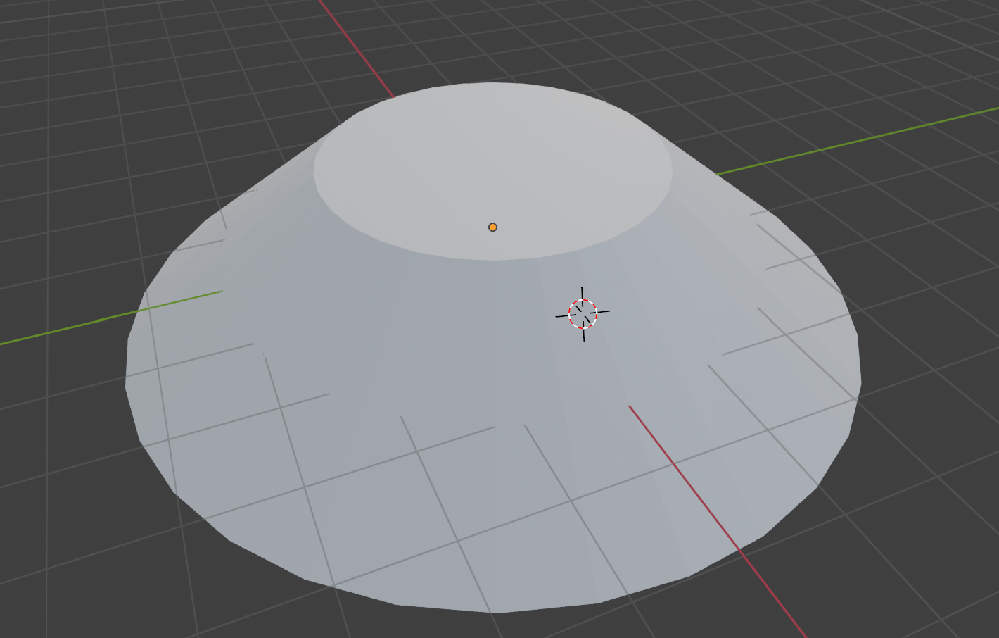

Meeting time: 2024/07/16: 9:00-10:30
### Advice
1. Don't need no heavy math definitions in your presentation, try to be more audience-friendly.
2. Try to introduce the stuff more intuitively, make your audience get the high level idea of the paper.
3. Watch TED videos, improve your presentation skill.

Remember: Improvement is hard, but worth it.

### Other stuff
1. Morse-Smale complex can be used for **Simplification**, **Segmentation**, etc. (Basically, the benefits of MSC)
2. Why we need Simulation of Simplicity (SoS): **Make the PL function a Morse Function (pairwise different function values)**
Imagine PL function case (not a Morse Function) like this:

Every points on the plateau is a maximum point (infinite number of maximum points), all of them are connected (or glued) with each other. With this configuration, it could be hard to divide the function into monotonic patches.
Fortunately, with SoS, we can avoid "=" in function values, which means every pair of  x1, x2 (they are connected in PL mesh), we can decide which one of their function values is **bigger or smaller**.
3. Feature of the Morse function:
All of the critical points of it are isolated (which is good for divied the function into monitonic patches).

